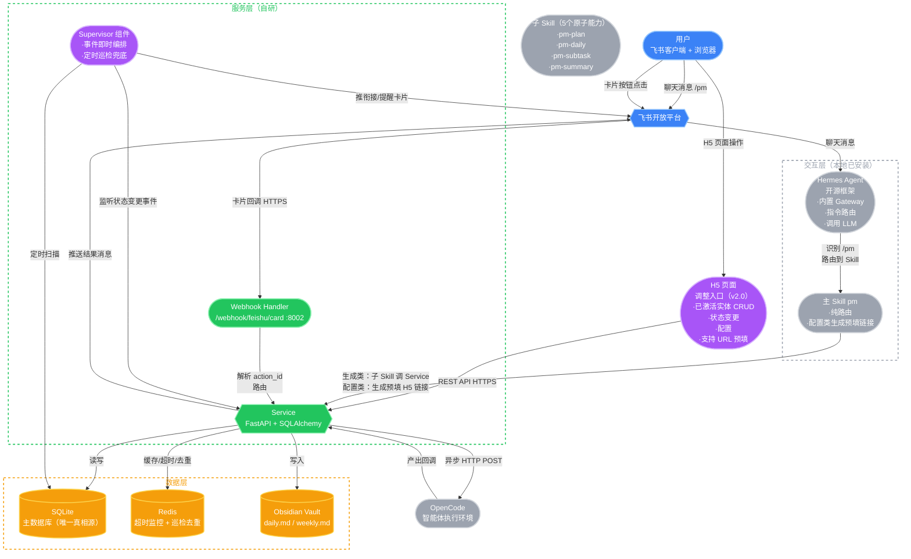
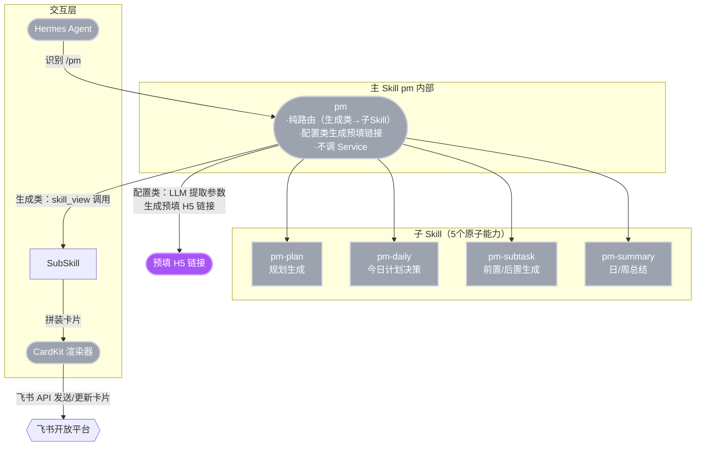
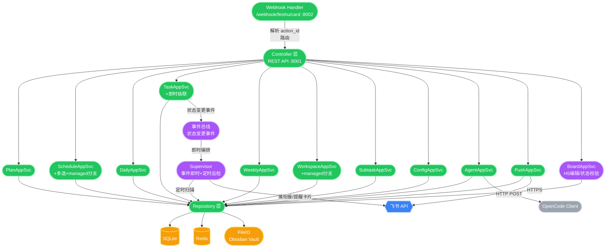
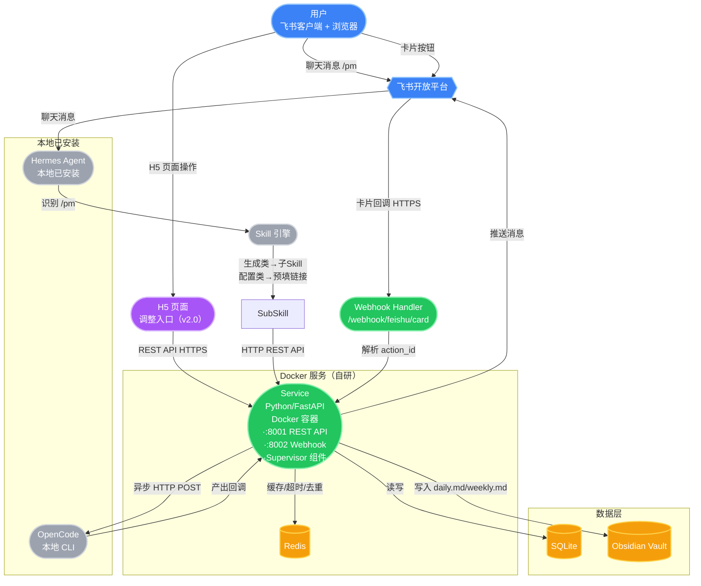

# 目标管理系统 — 系统架构文档

> 版本：v2.0
> 日期：2026-07-08
> 基于：目标管理系统完整方案 v2.0 + 流程优化方案（五轮 review 后）
> 变更（v2.0，五轮 review 后最终版）：
> 1. **入口 C 改为 H5 页面** — 自研 H5 页面（个人使用，无鉴权，支持 URL 参数预填）承载已激活实体调整；废弃飞书多维表格看板（不支持级联选择、record 变更事件订阅待验证）
> 2. **新增 Supervisor 组件** — 事件即时 + 定时巡检兜底（卡顿监测暂不做）
> 3. **Skill 重构为 5 个原子能力** — pm/pm-plan/pm-daily/pm-subtask/pm-summary
> 4. **pm 主路由纯路由 + 预填链接** — pm 不直接调 Service；生成类路由到子 Skill，配置类生成预填 H5 链接
> 5. **级联即时化** — 任务/阶段状态变更时即时向上级联（事务内），日终总结退化为纯回顾
> 6. **专题无序 + 阶段强约束** — 专题去 sort_order，阶段 roadmap 强约束
> 7. **executor 自动推断** — pm-daily 按专题 type 推断
> 8. **项目空间托管模式** — managed=1 系统托管；managed=0 关联已有路径（跳过初始化，不创建任何文件）
> 9. **drafts 表保留** — pm-plan 确认前存储规划数据（纯存储，不同步展示），规避飞书回调约 30KB 数据量限制
> 10. **去掉"需人工介入"终态** — 智能体任务 3 次不通过不改状态，用户"/pm 确认完成"

---

# 一、架构概述

## 1.1 设计哲学

本系统采用**双层架构模型 + 主动巡检层**：
- **交互层（Interaction Layer）**：负责用户对话、卡片拼装、会话管理。由 **Hermes Agent**（开源框架）承载，包含 Skill、Gateway。
  - Hermes Agent 内置 Gateway 和指令路由能力，识别 `/pm` 前缀后路由到 **主 Skill `pm`**。
  - `pm` 主 Skill 是纯路由：生成类指令通过 `skill_view()` 调用子 Skill（pm-plan/pm-daily/pm-subtask/pm-summary）；配置类指令由 pm LLM 提取参数生成预填 H5 链接（不调 Service）。
  - 子 Skill 内可调用 LLM 进行内容生成和意图理解。
- **服务层（Service Layer）**：负责业务逻辑、事务管理、数据持久化、外部系统调用。包含 AppService、Repository、外部客户端、Supervisor。
  - **Service 不直接调用 LLM**，所有 LLM 交互由交互层完成。
  - **Supervisor** 为 Service 内常驻组件，承担主动巡检与事件衔接编排。

**核心原则**：
1. **讨论态与执行态分离**：聊天只进讨论态，不触发数据库写操作；只有结构化回调（卡片按钮、H5 页面 API）触发执行态事务。
2. **Skill 作为 HTTP 客户端 + 原子能力**：Skill 不直接操作数据库，通过调用服务层 REST API 完成业务操作；Skill 仅承担"核心逻辑需要 LLM"的能力，纯确定性逻辑为 Service 代码。
3. **pm 主路由纯路由**：pm 不直接调 Service。生成类路由到子 Skill（子 Skill 调 Service）；配置类生成预填 H5 链接。
4. **轻量确认 + 异步重操作**：确认类 API 仅执行数据库写 + 即时级联（< 200ms），耗时操作异步执行。
5. **DB 为唯一真相源**：H5 页面为调整入口，编辑经 Service 校验落库（无反向同步，无多维表格）。
6. **事件即时 + 定时巡检兜底**：状态变更事件即时触发衔接/级联/推送；定时巡检兜底 deadline/未总结/衔接未响应提醒。
7. **飞书卡片数据量原则**：所有卡片避免一次性传大数据，只展示概览或少量项，回调只传标识符（draft_id/task_id 等），细节在 H5 页面。

## 1.2 双层职责划分

| 功能点 | 交互层 (Hermes Agent) | 服务层 (Service) |
|--------|----------------------|-----------------|
| 接收用户 `/pm` 指令 | ✅ Hermes Agent 框架识别 `/pm`，路由到主 Skill `pm` | ❌ |
| 主 Skill 路由 | ✅ pm 纯路由：生成类→子 Skill；配置类→生成预填 H5 链接 | ❌ |
| 生成草案内容（LLM） | ✅ 子 Skill 内调用 LLM 生成文案 | ❌ |
| 草案存/取/改 | ❌ 通过 API 操作 | ✅ 提供 `POST/PUT/GET/DELETE /drafts` 接口（纯存储，不同步展示） |
| 生成飞书卡片 | ✅ 子 Skill 根据 Service 返回数据调用 CardKit 拼装 | ❌ |
| 飞书卡片回调接收 | ❌ | ✅ Service `/webhook/feishu/card`，解析 `action_id` 硬编码路由 |
| H5 页面操作（入口 C） | ❌ | ✅ H5 页面调 Service REST API，校验落库 |
| 确认按钮的写操作 | ❌ | ✅ `POST /confirm` 等事务接口 |
| 事务管理（多表写入） | ❌ | ✅ `@Transactional` 管理 |
| **即时级联检查** | ❌ | ✅ 任务/阶段状态变更时事务内级联 |
| 创建物理目录 / git init | ❌ | ✅ 事务提交后异步执行（managed=1 时） |
| 调用 OpenCode 执行任务 | ❌ | ✅ 异步 HTTP POST 到 OpenCode 端口 |
| 监听 OpenCode 回调/超时 | ❌ | ✅ 提供内部回调接口 |
| 写入 daily.md / weekly.md | ❌ | ✅ 确认 API 中完成写入 |
| 用户聊天中的异议修正 | ✅ 子 Skill 内 LLM 理解意图，调用 Service `PATCH` | ✅ 提供单条修改 + 统计查询接口 |
| 子任务模板查询/管理 | ❌ | ✅ H5 页面 CRUD（ConfigAppSvc） |
| 项目空间关联设置 | ❌ | ✅ Story 2 卡片 A 调用（WorkspaceAppSvc）；H5 页面只读查看 |
| **主动巡检** | ❌ | ✅ Supervisor 组件：定时扫描 + 事件即时 |
| **阶段衔接建议** | ❌ | ✅ Supervisor：查下一阶段 + deadline 推算 + 推卡片 |
| 项目空间主 Agent 管理 | ❌ | ✅ 进程启动、端口分配、心跳检测、关机恢复 |
| 推送重复判断 | ❌ | ✅ 定时任务前检查当日/本周是否已推送 |

---

# 二、系统架构图

## 2.1 整体架构



> **图例**：🟢自研（Service/Webhook/Supervisor）⚪本地已安装（Hermes Agent/OpenCode）🟡数据层 🔵外部（飞书）🟣v2.0 新增（H5 页面/Supervisor）

> **三入口设计**：
> - **入口 A（聊天消息）**：用户发 `/pm` → 飞书 → Hermes Agent → Skill → Service REST API。进讨论态。
> - **入口 B（卡片回调）**：用户点卡片按钮 → 飞书 → Service `/webhook/feishu/card` → 硬编码路由 AppService → 事务。
> - **入口 C（H5 页面，v2.0）**：用户在 H5 页面操作 → 页面调 Service REST API → 校验落库。H5 页面是自研（个人使用，无鉴权），支持 URL 参数预填（pm 配置类指令生成预填链接）。
> - **Service 执行完成后**：统一调用飞书 API 推送结果消息；状态变更事件 → Supervisor 即时编排衔接。
> - **Supervisor 主动触发**：定时巡检（deadline/未总结/衔接未响应/scheduled_start_date 到了未激活）或监听状态变更事件（阶段完成 → 衔接下一阶段）。

## 2.2 交互层内部结构



> **说明**：
> - pm 主 Skill 纯路由：生成类（规划/今日计划/完成/总结）→ 子 Skill；配置类（配置/关联项目空间）→ LLM 提取参数生成预填 H5 链接（不调 Service）。
> - 子 Skill 内调用 LLM，LLM 调用由 Hermes Agent 框架统一管理。
> - 卡片回调、H5 页面 API 均不经过交互层，直接到 Service。

## 2.3 服务层内部结构



> **说明**：
> - Webhook Handler 接收飞书卡片回调（`/webhook/feishu/card`，解析 action_id 硬编码路由）。无多维表格回调（v2.0 改 H5 页面）。
> - TaskAppSvc 任务完成时事务内即时级联，发状态变更事件到事件总线。
> - WorkspaceAppSvc 按 managed 分支：托管初始化，关联跳过（不创建任何文件）。
> - BoardAppSvc 处理 H5 页面编辑：校验状态机 + 回退 reason → 落库 + status_change_log → 触发即时级联。无反向同步（无多维表格）。
> - Supervisor 监听事件总线（阶段完成→衔接）+ 定时巡检（deadline/未总结/衔接未响应/scheduled_start_date 到了未激活）。卡顿监测暂不做。

---

# 三、Supervisor 组件

## 3.1 定位

Supervisor 是 Service 内常驻组件，承担"主动巡检与事件衔接编排"。解决原架构"纯事件驱动、流程断裂"问题。

## 3.2 触发模型：事件即时 + 定时巡检兜底

### 事件即时（监听事件总线）

| 事件 | 即时动作 |
|------|----------|
| 阶段 status→已完成 | 查同专题 sort_order+1 下一阶段（强约束）→ 推衔接卡片（带 deadline 填写 + 确认激活/暂不激活） |
| 专题完成 | 推卡片列出未完成的其他专题（单选，专题无序）→ 用户选后 patch 填 deadline |
| 智能体产出回调 | 即时级联（TaskAppSvc）+ 验收卡片（AgentAppSvc） |
| 任务 status→已完成 | 即时级联（TaskAppSvc） |

### 定时巡检兜底（cron 扫描，复用 SQLite 索引）

| 巡检项 | 周期 | 动作 | 频率上限 |
|--------|------|------|----------|
| scheduled_start_date 到了未激活 | 每天 1 次（到点后） | 推提醒"你计划今天开始，要激活吗"→ 跳 Story 2。激活后停止 | 1 次/天 |
| deadline 临近（前 1 天/当天） | 每天 1 次 | 推进度提醒 + 跳 H5 页面按钮 | 1 次/天 |
| 当日未确认计划 | 10:00 | 提醒 | 1 次/天 |
| 当日未做日终总结 | 21:00 | 提醒 | 1 次/天 |
| 阶段衔接 24h 未响应 | 每天 1 次 | 再推一次衔接提醒 | 1 次 |

> **卡顿监测暂不做**（D18）：原设计的"任务卡顿询问"巡检暂不实现。

## 3.3 阶段衔接建议逻辑（确定性代码，非 LLM）

```
阶段完成事件 →
  Step 1: 查同专题 sort_order+1 的下一阶段（强约束，自动锁定）
  Step 2: 推算建议 deadline（剩余时间/剩余阶段数，结合任务数微调）
  Step 3: 推卡片"阶段X已完成，下一阶段Y，deadline：[date_picker]"
          按钮：确认激活 / 暂不激活
  Step 4: 用户填 deadline 确认 → 调度激活服务 → UPDATE phases.status='进行中'
  Step 5: 24h 未响应 → 定时巡检再推一次
```

> **为何不进 Skill**：查下一阶段 + deadline 推算是纯确定性逻辑（查询+计算），无需 LLM。符合"减少 Skill"原则。

## 3.4 巡检防骚扰机制

- 每项巡检每天最多推送 1 次。
- 已暂停实体不巡检。
- 巡检结果记录到 Redis（`supervisor:notified:{type}:{entity_id}:{date}`），避免重复推送。

---

# 四、H5 页面机制（v2.0，取代多维表格）

## 4.1 定位

H5 页面是规划确认后的调整入口，承载已激活实体的 CRUD、deadline、状态变更、配置。取代原设计的飞书多维表格看板（多维表格不支持级联选择、record 变更事件订阅待验证）。

## 4.2 形态

- **自研 H5 页面**（个人使用，无鉴权）
- **支持 URL 参数预填**：pm 配置类指令生成带参 H5 链接，页面读取参数预填表单，用户确认提交
- **点击级联展示**：目标→专题→阶段→任务，默认展开进行中的专题/阶段，已完成的折叠
- **DB 为唯一真相源**：H5 页面调 Service API 落库，无反向同步（无多维表格）

## 4.3 支持的操作（详见 Story 9）

- 字段编辑：名称/描述/deadline/executor
- 增删任务（物理删除）
- 阶段排序（任务排序不支持，交给 pm-daily）
- 状态变更：暂停（填 reason）/恢复（不填 reason）/回退（填 reason）
- 子任务模板 CRUD（Story 7，形态 B）
- 项目空间状态只读查看（managed/path，激活后不能改，设置在 Story 2）

## 4.4 预填链接机制

pm 配置类指令（`/pm 配置子任务`、`/pm 关联项目空间`）→ pm LLM 提取参数 → 拼成 URL 查询参数 → 生成 H5 链接 → 页面读取参数预填表单 → 用户确认提交 → 页面调 Service。

---

# 五、项目空间主 Agent 进程管理

## 5.1 启动时机

**首次下发智能体任务时启动**（Story 3 确认今日计划后异步触发，不是 Story 2 激活时）。

```
Story 3 确认今日计划 → 事务提交 → 异步触发
  │
  ├── 判断：今日任务中是否有 executor=智能体？
  │     ├── 否 → 不启动
  │     └── 是 → 继续
  │
  ├── 查询：该任务所属阶段的工作空间路径（workspace.path）
  │
  ├── 判断：该工作空间是否已有运行中的 opencode serve 进程？
  │     ├── 是 → 复用现有进程，HTTP POST 下发任务
  │     └── 否 → 启动新进程
  │
  └── 启动：opencode serve --directory /path/to/workspace --port <动态分配端口>
```

> **不受 managed 影响**：基于 workspace.path 启动，托管/关联一致。

## 5.2 进程生命周期

**阶段级常驻**：首个智能体任务触发启动；阶段完成（即时级联触发）后退出。

**3 次重试不通过**：系统 opencode serve 进程退出，用户手动接管；用户"/pm 确认完成"后系统重新启动 opencode serve（不同端口避免冲突）接管后续智能体任务。

## 5.3 端口管理（动态分配）

```
端口池（Service 层维护）
  ├── 可用端口范围：10000-20000
  ├── 启动时分配，退出/崩溃时回收
  └── agent_processes 表记录 {workspace_id, port, pid, status, started_at}
```

## 5.4 心跳检测

每 5 分钟对 status='running' 进程发 HTTP GET /health。无响应→重试 1 次→仍无响应→标记 crashed→自动重启（复用端口）→飞书通知。

## 5.5 关机恢复

系统启动时检查 status='running' 进程，PID 不存活则标记 crashed，自动重启。

## 5.6 数据模型

详见《数据模型文档 v2.0》2.10。

---

# 六、推送重复判断机制

## 6.1 日计划推送（8:30 定时）

```
定时触发前检查：
  查询 daily_records WHERE date = 今日
    存在 → 跳过
    不存在 → 生成并推送，INSERT daily_records (push_source='auto')
```

## 6.2 日终总结提醒（21:00）

```
查询 daily_records WHERE date = 今日 AND is_confirmed = 1
  已确认 → 跳过
  未确认 → 推送提醒
```

## 6.3 周总结推送（周日 12:00）

```
查询 weekly_records WHERE week = 本周
  存在 → 跳过
  不存在 → 生成并推送
```

## 6.4 用户手动触发

用户发"/pm 今日计划"等，查询当日/当周是否已有记录，已有则直接展示，无则生成。push_source='manual'。

## 6.5 每日计划过滤（v2.0 调整）

```
生成每日计划时：
  查询已激活阶段（phases.activated_at 有值，排除已暂停）
  （不再用 goals.scheduled_start_date 过滤，scheduled_start_date 仅用于提醒激活）
  对过滤后的阶段推荐任务
```

## 6.6 Supervisor 巡检去重

```
巡检推送前检查 Redis：supervisor:notified:{type}:{entity_id}:{date}
  存在 → 跳过（今日已推送）
  不存在 → 推送 → 写入 Redis（当日有效）
```

---

# 七、交互时序图

## 7.1 三入口时序图

```
入口 A — 聊天消息路径（:8001）：
  用户 → 飞书 → Hermes Agent（识别 /pm）→ Skill → Service :8001 REST API → 飞书推送结果

入口 B — 卡片回调路径（:8002）：
  用户 → 飞书 → Service :8002 /webhook/feishu/card（解析 action_id）→ AppService → 飞书推送结果

入口 C — H5 页面路径（:8001）：
  用户 → H5 页面 → Service :8001 REST API（BoardAppSvc）→ 校验落库
  （pm 配置类指令：用户 → pm LLM 提取参数 → 生成预填 H5 链接 → 用户在页面确认提交 → Service）
```

## 7.2 Story 1：目标规划与确认（聊天消息 + drafts 存储 + H5 调整）

```
用户        飞书      Hermes   pm-plan   Service层      SQLite      飞书API
 │            │            │            │            │            │            │
 │──/pm规划──►│            │            │            │            │            │
 │            │───────────►│            │            │            │            │
 │            │            │──路由────►│            │            │            │
 │            │            │            │──LLM生成──►│            │            │
 │            │            │            │  逐专题    │            │            │
 │            │            │            │──写drafts─►│            │            │
 │            │            │            │  (追加)    │            │            │
 │            │            │            │◄───────────│            │            │
 │            │            │◄───────────│            │            │            │
 │            │            │            │            │            │──发总览卡片──►│
 │            │            │            │            │            │  (概览+确认按钮,<30KB)
 │◄───────────│            │            │            │            │            │
 │            │            │            │            │            │            │
 │──点击确认──►│            │            │            │            │            │
 │  (只传draft_id)          │            │            │            │            │
 │            │───────────►│            │            │            │            │
 │            │            │            │            │──读drafts──►│            │
 │            │            │            │            │  写正式表+删draft        │
 │            │            │            │            │──COMMIT────►│            │
 │            │            │            │            │            │            │──推送H5链接──►│
 │◄───────────│            │            │            │            │            │
 │            │            │            │            │            │            │
 │──H5页面调整──────────────────────────────────────►│            │            │
 │            │            │            │            │──BoardAppSvc落库──►│            │
```

> **要点**：pm-plan 逐专题生成追加到 drafts；总览卡片只传 draft_id（规避 30KB 限制）；确认后读 drafts 写正式表删 drafts；H5 页面调整。

## 7.3 Story 3：当日计划确认与异步执行

```
用户        飞书      Hermes   pm-daily   Service层      SQLite     Redis   OpenCode   飞书API
 │──8:30定时──►│            │            │            │            │         │         │          │
 │            │───────────►│            │            │            │         │         │          │
 │            │            │──任务池预查询─►│            │            │         │         │          │
 │            │            │            │            │──SELECT(activated_at)──►│         │         │          │
 │            │            │            │◄───────────│            │         │         │          │
 │            │            │──LLM决策──►│            │            │         │         │          │
 │            │            │  +推断executor│            │            │         │         │          │
 │            │            │──调pm-subtask(前置整体)──►│            │         │         │          │
 │            │            │            │            │            │         │         │          │
 │            │            │            │            │            │──发卡片(任务勾选+前置勾选)──►│
 │◄───────────│            │            │            │            │         │         │          │
 │            │            │            │            │            │         │         │          │
 │──勾选+确认─►│            │            │            │            │         │         │          │
 │            │───────────►│            │            │            │         │         │          │
 │            │            │            │            │──@Trans────►│         │         │          │
 │            │            │            │            │  INSERT daily_records/tasks/subtasks       │         │          │
 │            │            │            │            │──COMMIT────►│         │         │          │
 │            │            │            │            │──异步触发──────────────────────►│          │
 │            │            │            │            │            │         │         │──执行───►│
 │            │            │            │            │            │         │         │──通知──►│
 │◄───────────│            │            │            │            │         │         │          │
```

## 7.4 阶段完成 → 即时衔接（Supervisor 编排）

```
Service层      事件总线      Supervisor     SQLite      飞书API      用户
   │──任务完成(事务内级联)──►│            │            │            │
   │            │──阶段完成事件──►│            │            │            │
   │            │            │──查下一阶段(sort_order+1)──►│            │
   │            │            │◄───────────│            │            │
   │            │            │──推算deadline                │            │
   │            │            │──推衔接卡片(deadline填写)──────────────────►│
   │            │            │            │            │            │──填deadline确认──►│
   │◄──激活请求──────────────────────────│            │            │            │
   │──UPDATE phases=进行中+即时级联──►│            │            │            │
   │──异步:工作空间初始化(managed分支)──►│            │            │            │
   │  若24h未响应：定时巡检再推一次 ◄──│            │            │            │
```

---

# 八、关键设计约束与注意事项

## 8.1 飞书回调 3 秒超时限制
所有确认类 API 仅执行数据库写 + 即时级联（纯 DB，<200ms），立即返回。耗时操作异步。

## 8.2 数据库事务与 IO 分离
事务内禁止 IO/HTTP；模式：写 DB + 即时级联 → 提交 → 异步 IO/HTTP。

## 8.3 即时级联在事务内
级联检查为纯 DB，与状态变更同事务，满足 3 秒回调。副作用异步。回退同样触发即时重算级联。

## 8.4 草稿数据由服务层管理（v2.0 调整）
- drafts 表保留，用于 pm-plan 确认前存储规划数据（纯存储，不同步展示）。
- 草稿乐观锁（version），24h 过期清理。
- **规避飞书回调数据量限制**：确认按钮回调只传 draft_id，规划数据可达几十 KB 不经回调。

## 8.5 卡片刷新使用 message_id
首次发送记录 message_id，更新通过"更新消息"接口刷新原卡片。

## 8.6 智能体重试上限（v2.0 调整）
验收不通过 retry_count 累加，上限 3 次。**3 次不通过不改状态**（去掉"需人工介入"终态），系统进程退出，飞书通知，用户介入后"/pm 确认完成"直接标记完成，系统重新接管后续智能体任务。

## 8.7 daily.md / weekly.md 语义
"用户确认版快照"，确认时写入。日终总结不再执行级联（级联已即时完成），仅写快照 + 标记 is_confirmed。

## 8.8 状态机约束（v2.0 扩充）
- 阶段：未开始/进行中/已完成/已暂停；支持进行中↔已暂停、已完成→进行中（回退，必填 reason）
- 任务：待执行/已完成/已暂停（**去"需人工介入"**）；支持待执行↔已暂停、已完成→待执行（回退，必填 reason）
- 回退/暂停写 status_change_log，回退触发即时重算级联。恢复不填 reason。

## 8.9 并发控制
全局"进行中"阶段 ≤3（已暂停不占名额）。专题内阶段严格串行（phases 唯一索引 (theme_id, sort_order)）。

## 8.10 超时监控兜底
Redis KeyExpirationEvent 超时兜底。OpenCode 2 小时内完成则删 Key，未完成则触发告警。

## 8.11 工作空间初始化幂等性（含 managed 分支）
- managed=1：事务外异步初始化（mkdir+git init+骨架含规范文件）
- managed=0：校验 path 存在性，不创建任何文件（包括规范文件），直接置已就绪
- 激活后不能改 managed

## 8.12 子任务模板合并规则
阶段级优先于专题级，同名去重，无顺序性。

## 8.13 配置态与执行态分离
子任务配置、项目空间关联走 H5 页面 CRUD（不建 Skill）。pm 配置类指令生成预填 H5 链接（不调 Service）。

## 8.14 推送重复判断
定时任务执行前检查当日/当周是否已有记录。Supervisor 巡检额外检查 Redis 去重 key。

## 8.15 项目空间主 Agent 进程管理
- 启动时机：首次下发智能体任务时（Story 3 确认后），Story 2 激活时不启动
- 生命周期：阶段级常驻，阶段完成（即时级联）后退出；3 次不通过退出，用户接管后重新启动
- 端口动态分配，心跳每 5 分钟，异常自动重启，关机恢复
- 不受 managed 影响

## 8.16 H5 页面一致性（v2.0）
- DB 为唯一真相源，H5 页面调 Service API 落库
- 无反向同步（无多维表格）
- 状态字段受限编辑（经 Service 校验状态机）

## 8.17 Skill 与 Service 能力边界
仅"核心逻辑需要 LLM"的能力做 Skill（共 5 个）。纯确定性逻辑为 Service 代码。详见《Skill 设计文档 v2.0》。

## 8.18 飞书卡片数据量原则（v2.0）
所有卡片避免一次性传大数据，只展示概览或少量项，回调只传标识符（draft_id/task_id 等），细节在 H5 页面。规划数据通过 drafts 表 + draft_id 传递，规避约 30KB 回调限制。

## 8.19 专题无序 + 阶段强约束（v2.0）
- 专题无序（去 sort_order），跨专题可并行推进
- 阶段 roadmap 强约束（按 sort_order 顺序激活，自动锁定第1个未开始阶段）
- 专题完成时给专题清单选（不能自动锁定下一专题）

## 8.20 executor 自动推断（v2.0）
任务规划态不填 executor，pm-daily 按专题 type 推断（learning/research/source→human；dev/survey→agent）。卡片只读，要改走 H5 页面。

## 8.21 前置/后置只服务人执行任务（v2.0）
- 前置按今日整体生成（不按单个任务），与任务解耦，两组独立勾选
- 后置按单个任务生成，和完成脱钩（完成即时级联，后置可选收尾，可全取消）
- 前置/后置都由 pm-subtask（LLM）生成，Service 不调 LLM
- 都智能体执行（opencode run）

---

# 九、部署方案

## 9.1 部署架构



## 9.2 组件说明

| 组件 | 来源 | 技术选型 | 部署方式 | 说明 |
|------|------|----------|----------|------|
| Hermes Agent | 本地已安装 | 开源框架 | 本地进程 | 接收飞书聊天消息，识别 /pm 路由到主 Skill，调用 LLM |
| Skill 引擎 | 跟随 Agent 框架 | Python + HTTP 客户端 | 同 Hermes Agent | 调 Service API，封装 CardKit |
| Service | 自研 | Python + FastAPI + SQLAlchemy | Docker 容器 | 业务逻辑、事务、主 Agent 进程管理、Webhook、Supervisor、即时级联 |
| H5 页面 | 自研（v2.0） | 前端（React/Vue 等） | 静态托管 | 调整入口，个人使用无鉴权，支持 URL 参数预填 |
| SQLite | 数据层 | 本地文件 | 卷挂载 | 主数据库（唯一真相源） |
| Redis | 数据层 | Redis 7.x | Docker 容器 | 超时监控、缓存、Supervisor 巡检去重 |
| OpenCode | 本地已安装 | 本地 CLI | 本地进程 | 智能体执行环境 |
| Obsidian Vault | 数据层 | 本地文件系统 | 卷挂载 | daily.md / weekly.md 存储 |

## 9.3 网络拓扑

```
飞书开放平台 ──HTTPS──► Hermes Agent (公网/内网穿透)
                              │
                              ├──HTTP──► LLM API (公网)
                              └──HTTP──► Service :8001 (内网，REST API)

飞书开放平台 ──HTTPS──► Service :8002 /webhook/feishu/card (公网/内网穿透)
                              └──内部路由──► AppService

H5 页面 ──HTTPS──► Service :8001 (REST API)
  （用户浏览器访问 H5 页面，页面调 Service API）

Service ──TCP──► SQLite
Service ──TCP──► Redis
Service ──FS───► Obsidian Vault
Service ──HTTP──► OpenCode 端口 (本地/动态分配)
Service ──HTTPS──► 飞书 API (推送消息)
OpenCode ──HTTP──► Service :8001 回调端点 (内网)
```

## 9.4 Webhook 暴露方案

飞书卡片回调需公网可访问的 HTTPS 地址。

### 方案 A：开发环境（内网穿透）
- ngrok：`ngrok http 8002`
- Cloudflare Tunnel：`cloudflared tunnel --url http://localhost:8002`（推荐，域名固定）

### 方案 B：生产环境（公网部署）
```
用户 → 飞书开放平台 → Nginx (反向代理) → Service:8002 (Webhook)
                          └── HTTPS (Let's Encrypt / 商业证书)
```

> **飞书回调配置**：飞书开放平台 → 事件与回调 → 请求网址填 `https://your-domain.com/webhook/feishu/card`

## 9.5 环境配置

```yaml
# docker-compose.yml 示例
version: '3.8'
services:
  service:
    build: ./service
    ports:
      - "8001:8001"  # REST API（Skill + H5 页面调用）
      - "8002:8002"  # Webhook（飞书卡片回调）
    volumes:
      - ./data:/app/data
      - ./vault:/app/vault
      - ./workspaces:/app/workspaces
    environment:
      - DATABASE_URL=sqlite:///app/data/pm.db
      - REDIS_URL=redis://redis:6379
      - OPENCODE_BASE_URL=http://host.docker.internal:8080
      - AGENT_PORT_RANGE=10000-20000
      - API_PORT=8001
      - WEBHOOK_PORT=8002
      - FEISHU_APP_ID=${FEISHU_APP_ID}
      - FEISHU_APP_SECRET=${FEISHU_APP_SECRET}
      - SUPERVISOR_ENABLED=true
      - H5_BASE_URL=https://pm.example.com  # v2.0 H5 页面基址
    depends_on:
      - redis

  redis:
    image: redis:7-alpine
    volumes:
      - redis_data:/data

volumes:
  redis_data:
```

> **本地已安装组件（不在 docker-compose 中）**：
> - **Hermes Agent**：本地运行，`SERVICE_URL=http://localhost:8001`
> - **OpenCode**：本地 CLI
> - **H5 页面**：静态托管（可放 Nginx 或对象存储），调 Service :8001

## 9.6 监控与日志

- **日志**：Service 输出结构化 JSON 日志，按 Story、action_id 追踪。Hermes Agent 和 OpenCode 日志独立。
- **监控**：Redis Key 监控（超时任务数、Supervisor 去重 key）、SQLite 慢日志、飞书回调延迟、主 Agent 进程心跳、Supervisor 巡检执行情况。
- **告警**：智能体超时、重试耗尽、工作空间初始化失败、数据库事务死锁、主 Agent 进程崩溃。

---

# 附录：操作流程

> 全部 Story 的详细操作流程和技术动作清单详见《操作流程与技术动作清单 v2.0》文档。
